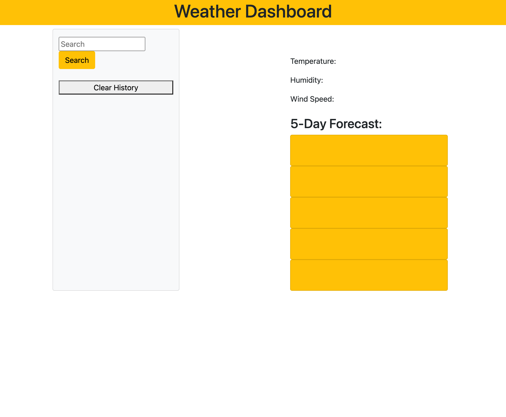

# weather-dashboard

## Overview

Created a dashboard thatn uses OpenWeather API to get data for cities that are searched by the user. It will give the temperature, humidity and windspeed. All of the data is stored in local storage so it allows users to retrieve that data again seamlessly. I used Javascript, Jquery, 

## Site Picture

